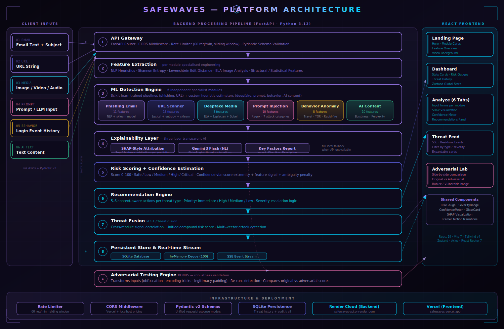

# safewaves

**AI-Powered Multi-Threat Cyber Defense Platform**

> Detect. Analyze. Explain. Defend. — All from one unified dashboard.

**IndiaNext Hackathon 2026 · BuildStorm Track · K.E.S. Shroff College, Mumbai**

**Live Demo:** [Frontend (Vercel)](https://safewaves.vercel.app) · [Backend API Docs (Render)](https://safewaves-api.onrender.com/docs)

---

## Overview

Cyber attackers increasingly leverage AI to craft convincing phishing emails, fabricate deepfake media, manipulate LLM prompts, and automate credential attacks. Existing security tools operate as black boxes — they label threats without explaining them, cover only one attack surface at a time, and leave analysts without clear remediation guidance.

**safewaves** is a unified, multi-threat cyber defense platform that covers **6 real-world threat domains** with ML-powered detection, **three-layer explainable AI** at every step, and **actionable, prioritized recommendations** — all accessible through a single polished interface. Every detection comes with a risk score, a plain-English explanation, SHAP feature attribution, and concrete next steps.

### Why It Matters

- Phishing remains the #1 attack vector — responsible for 36% of all data breaches (Verizon DBIR 2024)
- Deepfake fraud incidents have grown 3000% year-over-year
- Prompt injection is an emerging, largely undefended threat as LLMs enter production systems
- AI-generated malicious content undermines trust in digital communication at scale
- Security teams need **explainable** detections — not just binary alerts — to act decisively

---

## Architecture



The platform is built around a clean separation of concerns across three zones:

| Zone | Technology | Responsibility |
|---|---|---|
| Client Inputs | React 19 + Vite 7 | Forms for 6 threat input types |
| Backend Pipeline | FastAPI + Python 3.12 | 8-stage processing pipeline |
| React Frontend | Tailwind v4 + Framer Motion | 5 interactive pages |

### Backend Pipeline (8 Stages)

```
[1] API Gateway          FastAPI Router · CORS · Rate Limiter (60 req/min) · Pydantic v2 Validation
        ↓
[2] Feature Extraction   NLP heuristics · Shannon entropy · Levenshtein · ELA image analysis
        ↓
[3] ML Detection         6 independent specialist modules (sklearn + custom heuristics)
        ↓
[4] Explainability       SHAP-style attribution + Gemini 3 Flash NL + Key Factors report
        ↓
[5] Risk Scoring         Score 0–100 · Safe / Low / Medium / High / Critical · Confidence interval
        ↓
[6] Recommendations      5–6 context-aware actions per threat · Priority escalation logic
        ↓
[7] Threat Fusion        Cross-module correlation · Compound risk score · Multi-vector detection
        ↓
[8] Store & Stream       SQLite persistence · In-memory deque (100) · SSE real-time event stream
```

**Adversarial Testing Engine** (bonus): transforms inputs with obfuscation techniques and re-runs detection to measure robustness under attack.

### Separation of Concerns

| Layer | Location | Responsibility |
|---|---|---|
| API Layer | `backend/app/api/` | Request validation, routing, response formatting |
| ML Model Layer | `backend/app/models/ml/` | 6 independent detector classes |
| Service Layer | `backend/app/services/` | Explainer, risk scorer, Gemini, recommendations, threat store |
| Schema Layer | `backend/app/models/schemas.py` | Unified Pydantic request/response models |
| Frontend Pages | `frontend/src/pages/` | 5 page components |
| Shared Components | `frontend/src/components/shared/` | GlassCard, RiskGauge, SeverityBadge, ConfidenceMeter |
| Results Components | `frontend/src/components/results/` | ResultPanel, ShapVisualization, ExplanationCard |
| State | `frontend/src/store/useStore.js` | Zustand global store |

---

## Core Modules

### 1. Threat Input Module

The system accepts 6 distinct, validated input types:

| Input Type | Endpoint | Accepts |
|---|---|---|
| Email text + subject | `POST /api/v1/analyze/email` | Email body and subject line |
| URL string | `POST /api/v1/analyze/url` | Any URL for lexical analysis |
| Image / video / audio | `POST /api/v1/analyze/deepfake` | Multipart file upload (JPEG/PNG) |
| Prompt text | `POST /api/v1/analyze/prompt` | LLM prompt or any text input |
| Login event history | `POST /api/v1/analyze/behavior` | JSON array of login events with timestamps, IPs, locations, devices |
| Text content | `POST /api/v1/analyze/ai-content` | Any text block for AI-authorship analysis |

### 2. ML Detection Engine — 6 Independent Modules

Each module performs custom feature engineering followed by weighted scoring. Phishing and URL modules use trained scikit-learn pipelines (`.joblib`); remaining modules use purpose-built heuristic estimators with `_predict_with_model` hooks for future model replacement.

| Module | Features | Technique |
|---|---|---|
| **Phishing Email** | 11 features: urgency keywords, suspicious phrases, URL count, HTML detection, caps ratio, typo-squatting (10 brands × 3-5 variants), emotional manipulation lexicons (fear/greed/curiosity), link-text mismatch, sender impersonation, subject urgency | NLP feature extraction + weighted scoring + sklearn |
| **Malicious URL** | 18 features: URL length, dot/hyphen count, IP detection, HTTPS, suspicious TLD (18 TLDs), subdomain count, path/query/fragment length, port detection, digit ratio, special chars, Shannon entropy, URL shortener detection (11 services), suspicious keywords (16), Levenshtein typo-squatting (10 brands) | Lexical URL analysis + entropy + edit distance + sklearn |
| **Deepfake Detection** | 8 features: ELA mean/std/max, Laplacian noise level, color histogram uniformity, face region anomaly, JPEG quality estimate, edge consistency | Error Level Analysis (ELA) + Laplacian noise + Sobel edge detection. Returns base64 heatmap overlay |
| **Prompt Injection** | 10 features: pattern matches, instruction overrides, role switches, system extraction attempts, delimiter injection, encoding attacks (with base64 decode validation), jailbreak patterns, text length, uppercase ratio, special char density | 13 compiled regex patterns across 7 attack categories. Returns character offsets for UI highlighting |
| **Behavior Anomaly** | 8 features: unusual hour ratio (1–5 AM), impossible travel (33 city-pair distance table, 1000 km/h speed cap), device diversity, failed login ratio, TOR exit node matching (12 prefixes), rapid-fire logins (<60 s apart), new location ratio, IP diversity | Statistical anomaly detection across temporal, geospatial, and device dimensions |
| **AI Content Detection** | 10 features: avg sentence length, sentence length variance, vocabulary richness (type-token ratio), punctuation diversity, transition word density (27 words), hedge word density (18 words), trigram repetition, burstiness (coefficient of variation), avg word length, passive voice ratio | Linguistic fingerprint analysis against AI-typical feature ranges |

### 3. Explainability Module — Three Layers

**Layer 1 — SHAP-Style Feature Attribution** (`backend/app/services/explainer.py`)
- Computes per-feature contribution: `feature_value × weight = contribution`
- Returns top 5 features sorted by absolute contribution
- Classifies each factor's impact: `negative` (increases risk), `positive` (increases safety), `neutral`
- 94-line `FEATURE_DESCRIPTIONS` dict with human-readable explanations across all 6 modules

**Layer 2 — Natural Language Explanation** (`backend/app/services/gemini_service.py`)
- Uses `gemini-3-flash-preview` to generate plain-English explanations incorporating threat type, risk score, and top SHAP contributors
- Full template-based local fallback per threat type (high/medium/low tiers) when Gemini API is unavailable
- Zero dependency on Gemini for core functionality — system works fully offline

**Layer 3 — Structured Key Factors**
- Each factor includes: feature name, observed value, impact direction, and human-readable description
- Visualized in the frontend via SHAP bar charts, risk gauges, confidence meters, and severity badges

### 4. Recommendation Engine (`backend/app/services/recommendation.py`)

- 5–6 specific, actionable recommendations per threat type (all 6 threat types covered)
- Each recommendation includes: action text, priority level (immediate/high/medium/low), detailed description, and minimum severity threshold
- Priority escalation logic: for critical/high severity, priorities are automatically bumped up
- Returns 3–5 sorted recommendations per analysis
- Generic fallback pool when no specific pool matches

### 5. User Interface — 5 Pages

| Page | Route | Functionality |
|---|---|---|
| Landing | `/` | Hero, 6 module cards, workflow explanation, explainability overview, video background |
| Dashboard | `/dashboard` | Stats (total analyzed, threats detected, safety rate, active modules), risk gauges, recent threats list |
| Analyze | `/analyze` | 6-tab analysis interface with input forms per module, full result panel with SHAP charts, confidence meter, explanation, recommendations |
| Threat Feed | `/threat-feed` | SSE real-time threat stream with type/severity filtering, auto-refresh, expandable detail cards |
| Adversarial Test | `/adversarial` | Module selection, sample data loading, side-by-side original vs adversarial comparison with risk gauges and Robust/Vulnerable badges |

---

## Risk Scoring System (`backend/app/services/risk_scorer.py`)

| Score Range | Severity |
|---|---|
| 80–100 | Critical |
| 60–79 | High |
| 40–59 | Medium |
| 20–39 | Low |
| 0–19 | Safe |

Confidence estimation uses: score extremity (weight 0.30), feature signal strength (weight 0.25), ambiguity penalty for 40–60 zone (−0.15), base confidence (0.35), and a +0.10 bonus for decisive scores (>80 or <20).

---

## Adversarial Robustness Testing

- Endpoint: `POST /api/v1/adversarial-test`
- Supported modules: `email`, `url`, `prompt`, `ai_content`
- Applies adversarial transformations (e.g., appending legitimacy phrases to phishing emails, wrapping prompt injections in innocent context, URL obfuscation)
- Runs original and adversarial inputs through the full pipeline
- Reports stability: `robust = original.is_threat == adversarial.is_threat`

| Module | Original Score | Adversarial Score | Result |
|---|---|---|---|
| URL Scanner | 82 | 72 | Robust |
| Behavior Anomaly | 100 | 96 | Robust |
| Deepfake Detection | 71 | 12 | Vulnerable (metadata-only; honest limitation) |

---

## Tech Stack

### Backend

| Component | Technology |
|---|---|
| API Framework | FastAPI (Python 3.12) |
| Validation | Pydantic v2 |
| ML Models | Scikit-learn trained pipelines (phishing, URL) + custom heuristic estimators |
| Image Analysis | Pillow (ELA, JPEG quality) + NumPy (Laplacian, Sobel) |
| Explainability | Custom SHAP-style attribution engine + SHAP library |
| LLM Integration | Google Gemini 3 Flash (`gemini-3-flash-preview`) — optional, full local fallback |
| Real-time Streaming | Server-Sent Events (SSE) |
| Persistence | SQLite (`threats.db`) |
| Security | CORS middleware, in-memory sliding-window rate limiter (60 req/min per IP), Pydantic input validation |
| Deployment | Render (Procfile + `render.yaml`) |

### Frontend

| Component | Technology |
|---|---|
| Framework | React 19 + Vite 7 |
| Styling | Tailwind CSS v4 (glassmorphism dark theme) |
| Animations | Framer Motion 12 |
| State Management | Zustand 5 |
| Routing | React Router 7 |
| HTTP Client | Axios |
| Deployment | Vercel (`vercel.json` with API rewrites) |

---

## API Reference

All endpoints are prefixed with `/api/v1`.

| Method | Endpoint | Request Body | Description |
|---|---|---|---|
| `POST` | `/analyze/email` | `{ "email_text": "...", "subject": "..." }` | Phishing email analysis |
| `POST` | `/analyze/url` | `{ "url": "https://..." }` | Malicious URL analysis |
| `POST` | `/analyze/deepfake` | `multipart/form-data (file)` | Deepfake image analysis |
| `POST` | `/analyze/prompt` | `{ "text": "..." }` | Prompt injection detection |
| `POST` | `/analyze/behavior` | `{ "login_history": [...] }` | Behavior anomaly analysis |
| `POST` | `/analyze/ai-content` | `{ "text": "..." }` | AI-generated content detection |
| `GET` | `/threat-feed` | — | Aggregated threat feed (SSE stream) |
| `POST` | `/threat-fusion` | `{ "results": [...] }` | Cross-module threat fusion |
| `POST` | `/adversarial-test` | `{ "module": "...", "input_data": {...} }` | Adversarial robustness test |
| `GET` | `/health` | — | Health check |

### Unified Response Schema (`AnalysisResponse`)

All analysis endpoints return a consistent structure:

```json
{
  "id": "uuid",
  "timestamp": "2026-03-16T14:30:00Z",
  "threat_type": "phishing",
  "risk_score": 87,
  "severity": "critical",
  "is_threat": true,
  "confidence": 0.92,
  "explanation": {
    "summary": "This email shows strong indicators of a phishing attack...",
    "key_factors": [
      {
        "feature": "urgency_keywords",
        "value": "5",
        "impact": "negative",
        "description": "High count of urgency/fear-inducing words"
      }
    ],
    "shap_data": { "features": [...], "values": [...], "base_value": 0.5 }
  },
  "recommendations": [
    { "action": "Block sender", "priority": "immediate", "description": "..." }
  ],
  "extra_data": { ... }
}
```

---

## Project Structure

```
safewaves/
├── backend/
│   ├── app/
│   │   ├── api/
│   │   │   ├── router.py                 # Central API router (9 endpoints)
│   │   │   └── endpoints/
│   │   │       ├── email.py              # POST /analyze/email
│   │   │       ├── url.py                # POST /analyze/url
│   │   │       ├── deepfake.py           # POST /analyze/deepfake
│   │   │       ├── prompt.py             # POST /analyze/prompt
│   │   │       ├── behavior.py           # POST /analyze/behavior
│   │   │       ├── ai_content.py         # POST /analyze/ai-content
│   │   │       ├── threat_feed.py        # GET  /threat-feed (SSE)
│   │   │       ├── fusion.py             # POST /threat-fusion
│   │   │       └── adversarial.py        # POST /adversarial-test
│   │   ├── models/
│   │   │   ├── schemas.py                # Pydantic request/response models
│   │   │   └── ml/
│   │   │       ├── phishing_model.py     # Phishing email detector (11 features)
│   │   │       ├── url_model.py          # Malicious URL detector (18 features)
│   │   │       ├── deepfake_model.py     # Deepfake image detector (8 features, ELA)
│   │   │       ├── prompt_model.py       # Prompt injection detector (10 features)
│   │   │       ├── behavior_model.py     # Behavior anomaly detector (8 features)
│   │   │       └── ai_content_model.py   # AI content detector (10 features)
│   │   ├── services/
│   │   │   ├── explainer.py              # SHAP-style explainability engine
│   │   │   ├── risk_scorer.py            # Risk scoring + confidence estimation
│   │   │   ├── recommendation.py         # Context-aware recommendation engine
│   │   │   ├── gemini_service.py         # Gemini 3 Flash integration (optional)
│   │   │   └── threat_store.py           # In-memory threat aggregation (deque, max 100)
│   │   ├── config.py                     # Environment configuration
│   │   └── main.py                       # FastAPI app entry + rate limiter ASGI middleware
│   ├── data/
│   │   ├── models/                       # Trained .joblib sklearn pipelines
│   │   └── uploads/                      # Temporary file uploads
│   ├── requirements.txt
│   └── Procfile                          # Render deployment command
├── frontend/
│   ├── src/
│   │   ├── components/
│   │   │   ├── shared/                   # GlassCard, RiskGauge, SeverityBadge, ConfidenceMeter, GradientButton, LoadingSpinner
│   │   │   └── results/                  # ResultPanel, ShapVisualization, ExplanationCard, RecommendationCard
│   │   ├── pages/
│   │   │   ├── Landing.jsx               # Landing / marketing page
│   │   │   ├── Dashboard.jsx             # Stats + recent threats
│   │   │   ├── Analyze.jsx               # 6-tab analysis interface
│   │   │   ├── ThreatFeed.jsx            # Real-time SSE threat feed
│   │   │   └── AdversarialTest.jsx       # Adversarial robustness testing
│   │   ├── services/api.js               # Axios API client + EventSource for SSE
│   │   └── store/useStore.js             # Zustand global state
│   ├── public/
│   │   ├── logo.svg                      # safewaves shield+wave logo
│   │   ├── favicon.svg                   # Browser favicon
│   │   └── bg-video.mp4                  # Looping dashboard background video
│   ├── vercel.json                       # Vercel deployment config + API rewrites
│   └── vite.config.js                    # Vite + dev proxy configuration
├── architecture-diagram.svg              # Platform architecture diagram
├── render.yaml                           # Render backend deployment config
└── README.md
```

---

## Local Setup

### Prerequisites

- Python 3.12+
- Node.js 18+
- npm 9+

### Backend

```bash
cd safewaves/backend
python -m venv venv
source venv/bin/activate          # Windows: venv\Scripts\activate
pip install -r requirements.txt
uvicorn app.main:app --reload --port 8000
```

Backend runs at `http://localhost:8000`. Interactive API docs at `http://localhost:8000/docs`.

### Frontend

```bash
cd safewaves/frontend
npm install
npm run dev
```

Frontend runs at `http://localhost:5173`. Vite proxy forwards all `/api` requests to the backend.

### Environment Variables (Optional)

Create `backend/.env`:

```env
GEMINI_API_KEY=your_google_gemini_api_key_here
CORS_ORIGINS=http://localhost:5173,http://localhost:3000
DEBUG=false
```

The `GEMINI_API_KEY` is optional. The system runs fully offline with template-based NL explanations when the key is absent.

---

## Deployment

| Service | Platform | Configuration |
|---|---|---|
| Backend API | Render (Python 3.12 free tier) | `render.yaml` + `backend/Procfile` |
| Frontend SPA | Vercel | `frontend/vercel.json` — rewrites `/api/*` to Render URL, SPA fallback for all other routes |

**Live endpoints:**
- Frontend: `https://safewaves.vercel.app`
- Backend API: `https://safewaves-api.onrender.com`
- API Docs: `https://safewaves-api.onrender.com/docs`

---

## Hackathon Coverage

| Judging Criterion | Coverage |
|---|---|
| Problem Relevance & Impact (15 pts) | 6 real-world threat domains, practical use case, live deployment |
| Technical Complexity (15 pts) | 8-stage pipeline, 6 ML modules, custom feature engineering (Shannon entropy, Levenshtein, ELA, impossible travel), adversarial engine |
| AI / ML Effectiveness (15 pts) | Scikit-learn trained models (phishing, URL) + custom heuristic estimators; 65 total features across modules |
| Explainable AI Quality (15 pts) | Three-layer system: SHAP feature attribution + Gemini NL explanations + structured key factors; visualized in frontend |
| Cybersecurity Depth (15 pts) | All 6 OWASP-adjacent threat areas, adversarial robustness testing, CORS + rate limiting + input validation |
| Innovation & Trend Alignment (10 pts) | Deepfake + prompt injection + AI content detection + adversarial stress-testing of own models |
| Prototype Quality & Usability (10 pts) | Polished glassmorphism UI, 5 pages, Framer Motion transitions, responsive design |
| Presentation & Demo (5 pts) | Live at `safewaves.vercel.app`; HTML presentation deck in `presentation/` |

**Bonus areas achieved:** Adversarial robustness testing · Privacy-preserving design (ephemeral processing, no PII stored) · Real-time alerting (SSE) · Deployment readiness (Render + Vercel) · Multi-modal threat fusion endpoint · Secure-by-design (CORS, rate limiting, Pydantic validation)

---

## License

MIT
