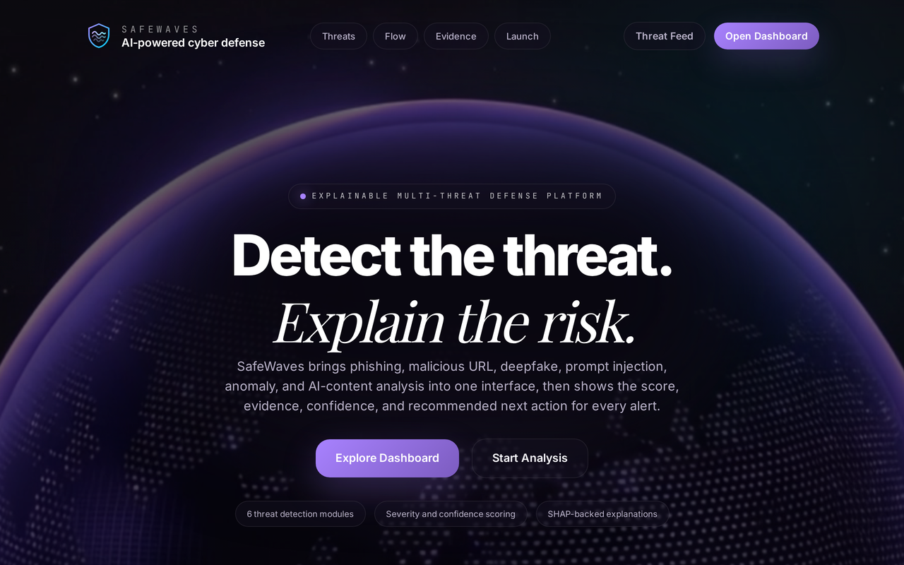

<div align="center">

# safewaves

**Multi-threat cyber-defense platform with explainable detection.**

Six ML detectors for phishing, malicious URLs, deepfake images, prompt injection, login anomalies, and AI-generated text. Every verdict comes with a risk score, a SHAP attribution, a plain-English reason, and concrete next steps.


[**Live demo**](https://safewaves.vercel.app) · [**API docs**](https://safewaves-api.onrender.com/docs)



</div>

> **First load:** the API runs on Render's free tier and sleeps when idle, so the first request can take 30 to 60 seconds to wake up. If an analysis hangs on the first try, give it a moment and retry, or open the [API docs](https://safewaves-api.onrender.com/docs) first to warm the server.

---

## What it does

Most security tools label a threat without explaining it, cover one attack surface at a time, and leave you without a next step. safewaves covers six threat domains in one interface, and every detection returns a risk score, a feature attribution, a plain-English explanation, and prioritized recommendations.

## Architecture


| Zone | Technology | Responsibility |
|---|---|---|
| Client inputs | React 19 + Vite 7 | Forms for the 6 threat input types |
| Backend pipeline | FastAPI + Python 3.12 | 8-stage processing pipeline |
| Frontend | Tailwind v4 + Framer Motion | 5 interactive pages |

### Backend pipeline (8 stages)

```
[1] API gateway          FastAPI router · CORS · rate limiter (60 req/min) · Pydantic v2 validation
        ↓
[2] Feature extraction   NLP heuristics · Shannon entropy · Levenshtein · ELA image analysis
        ↓
[3] ML detection         6 independent detector modules (sklearn + custom heuristics)
        ↓
[4] Explainability       SHAP-style attribution + Gemini NL reason + key factors
        ↓
[5] Risk scoring         score 0-100 · Safe / Low / Medium / High / Critical · confidence
        ↓
[6] Recommendations      3-5 context-aware actions per threat · priority escalation
        ↓
[7] Threat fusion        cross-module correlation · compound risk · multi-vector detection
        ↓
[8] Store & stream       SQLite persistence · in-memory deque (100) · SSE event stream
```

## The six detectors

Phishing and URL run trained scikit-learn pipelines. The rest use purpose-built heuristic estimators with `_predict_with_model` hooks for swapping in trained models later. 65 engineered features in total.

| Module | Features | Technique |
|---|---|---|
| **Phishing email** | 11: urgency keywords, suspicious phrases, URL count, HTML, caps ratio, typo-squatting, emotional manipulation lexicons, link-text mismatch, sender impersonation, subject urgency | NLP feature extraction + weighted scoring + sklearn |
| **Malicious URL** | 18: length, dot/hyphen count, IP detection, HTTPS, suspicious TLD, subdomain count, path/query length, port, digit ratio, special chars, Shannon entropy, shortener detection, Levenshtein typo-squatting | Lexical analysis + entropy + edit distance + sklearn |
| **Deepfake image** | 8: ELA mean/std/max, Laplacian noise, color histogram uniformity, face anomaly, JPEG quality, edge consistency | Error Level Analysis + Laplacian noise + Sobel edges, returns a base64 heatmap overlay |
| **Prompt injection** | 10: pattern matches, instruction overrides, role switches, system extraction, delimiter injection, encoding attacks, jailbreak patterns, length, uppercase ratio, special-char density | 13 compiled regex patterns across 7 attack categories, returns character offsets for UI highlighting |
| **Behavior anomaly** | 8: unusual-hour ratio, impossible travel (city-pair distance table, 1000 km/h cap), device diversity, failed-login ratio, TOR exit-node match, rapid-fire logins, new-location ratio, IP diversity | Statistical anomaly detection across time, geo, and device |
| **AI-content** | 10: avg sentence length and variance, vocabulary richness, punctuation diversity, transition-word density, hedge-word density, trigram repetition, burstiness, avg word length, passive-voice ratio | Linguistic fingerprint against AI-typical feature ranges |

## Explainability

Three layers behind every verdict:

1. **SHAP-style attribution** (`explainer.py`). Per-feature contribution (`value × weight`), top 5 by absolute impact, each tagged as increasing risk, increasing safety, or neutral.
2. **Natural-language reason** (`gemini_service.py`). Gemini 3 Flash writes a plain-English explanation from the threat type, risk score, and top contributors. There is a full template fallback per threat type, so the system runs offline with no key.
3. **Structured key factors.** Each factor carries its name, observed value, impact direction, and a human-readable description, rendered as bars, gauges, and badges in the UI.

## Adversarial testing

`POST /api/v1/adversarial-test` transforms an input (legitimacy phrases on a phishing email, innocent wrappers around a prompt injection, URL obfuscation), re-runs the full pipeline, and reports whether the verdict held.

| Module | Original score | Adversarial score | Result |
|---|---|---|---|
| URL scanner | 82 | 72 | Robust |
| Behavior anomaly | 100 | 96 | Robust |
| Deepfake image | 71 | 12 | Vulnerable (metadata-only, honest limitation) |

## API

All endpoints are prefixed with `/api/v1`.

| Method | Endpoint | Body | Description |
|---|---|---|---|
| `POST` | `/analyze/email` | `{ email_text, subject }` | Phishing email analysis |
| `POST` | `/analyze/url` | `{ url }` | Malicious URL analysis |
| `POST` | `/analyze/deepfake` | `multipart/form-data (file)` | Deepfake image analysis |
| `POST` | `/analyze/prompt` | `{ text }` | Prompt injection detection |
| `POST` | `/analyze/behavior` | `{ login_history }` | Login behavior anomaly |
| `POST` | `/analyze/ai-content` | `{ text }` | AI-generated text detection |
| `GET` | `/threat-feed` | none | Threat feed (SSE stream) |
| `POST` | `/threat-fusion` | `{ results }` | Cross-module threat fusion |
| `POST` | `/adversarial-test` | `{ module, input_data }` | Adversarial robustness test |
| `GET` | `/health` | none | Health check |

Every analysis returns the same shape:

```json
{
  "threat_type": "phishing",
  "risk_score": 87,
  "severity": "critical",
  "is_threat": true,
  "confidence": 0.92,
  "explanation": {
    "summary": "This email shows strong indicators of a phishing attack...",
    "key_factors": [
      { "feature": "urgency_keywords", "value": "5", "impact": "negative",
        "description": "High count of urgency/fear words" }
    ],
    "shap_data": { "features": [], "values": [], "base_value": 0.5 }
  },
  "recommendations": [
    { "action": "Block sender", "priority": "immediate", "description": "..." }
  ]
}
```

## Tech stack

**Backend.** FastAPI (Python 3.12), Pydantic v2, scikit-learn, Pillow + NumPy for image analysis, a SHAP-style attribution engine, Gemini 3 Flash (optional, with local fallback), Server-Sent Events, SQLite, a sliding-window rate limiter.

**Frontend.** React 19 + Vite 7, Tailwind CSS v4, Framer Motion 12, Zustand 5, React Router 7, Axios.

## Project structure

```
backend/
  app/
    api/endpoints/   9 analysis + feed + fusion + adversarial routes
    models/ml/       6 detector classes
    models/schemas.py
    services/        explainer, risk_scorer, recommendation, gemini, threat_store
    main.py          FastAPI app + rate-limiter middleware
  data/models/       trained .joblib pipelines
frontend/
  src/
    pages/           Landing, Dashboard, Analyze, ThreatFeed, AdversarialTest
    components/       shared (GlassCard, RiskGauge, ...) + results (ShapVisualization, ...)
    store/useStore.js
architecture-diagram.svg
render.yaml
```

## Local setup

**Backend** (Python 3.12+)

```bash
cd backend
python -m venv venv && source venv/bin/activate
pip install -r requirements.txt
uvicorn app.main:app --reload --port 8000     # docs at /docs
```

**Frontend** (Node 18+)

```bash
cd frontend
npm install
npm run dev                                    # http://localhost:5173, /api proxied to backend
```

`backend/.env` is optional. Set `GEMINI_API_KEY` for the LLM reason layer; without it the system uses template explanations. `CORS_ORIGINS` controls allowed origins.

## Deployment

| Service | Platform | Config |
|---|---|---|
| Backend API | Render (free tier) | `render.yaml` + `backend/Procfile` |
| Frontend | Vercel | `frontend/vercel.json` rewrites `/api/*` to the Render URL |

## License

MIT
